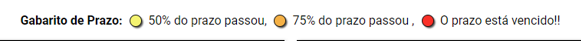
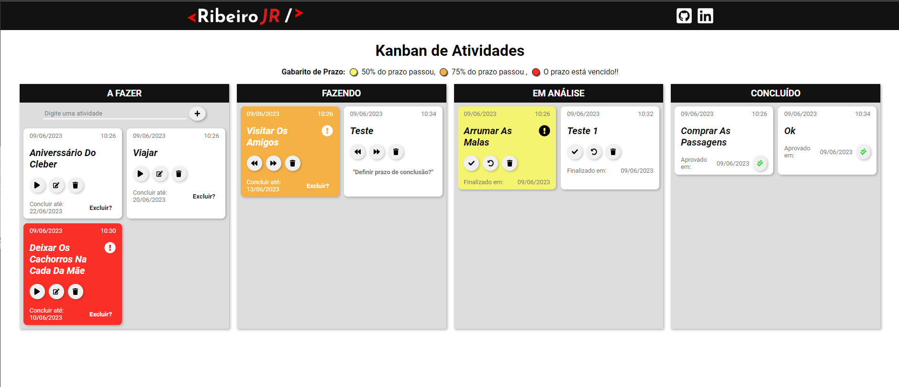

# 🕮 Projeto Kanban
<p>  </p>

## 🛠️ Construído com
&nbsp;
&nbsp;
&nbsp;
&nbsp;

<a href="https://kanban-ribeirojr.netlify.app/" target="_blank">🔗 Acesse o Projeto Aqui</a>

## 📌 Sobre o Projeto
Esse projeto e uma espécie de quadro kanban, que contem quatro etapas, começando do quadro em que se encontra as atividades a serem feitas e em seguinda partimos para o quadro de atividades em andamento, são aquelas que ja foram iniciadas, no terceiro quadro e onde as atividades entram e análise, e ali as atividades são aprovadas ou reprovadas, caso seja reprovada a atividade retorna para o primeiro quadro e caso contrario ela e finalizada encontrando-se no quadro de atividades concluídas.

```
OBS: Essas atividades serão salvas no localStorage 
```

## ⚙️ Funções

1 - Primeira função, e onde cria as atividades, com informações de data e hora de criação e titulo.

2 - Segunda função, com o icone de play inicia o andamento da atividade.

3 - Terceira função, com o icone de edição e onde edita o titulo da atividade.
```
Essa função abre um modal com um input para preencher com determinado titulo 
```
4 - Também encontra-se uma função que define uma data de conclusão para a atividade.
```
Quando definido uma data de conclusão os cards são renderizados de acordo com a porcentagem que o prazo se encontra,
segue o gabarito abaixo:
```
&nbsp;

5 - Quarta função, com o icone de uma lixeira é onde excluí a atividade que se encontra em quase todos os quadros.

6 - No quadro de atividades em andamento encontra-se um botão para avançar ou retroceder a atividade.

7 - No quadro de análise a funções podem reprovar ou aprovar uma atividade.

```
Aprovando a atividade ela prossegue para o quadro de atividades concluída.
```
```
Reprovando a atividade volta para o primeiro quadro.
```
8 - E no ultimo quadro encontra-se somente uma função com o icone de checagem, onde exclúi a atividade.

&nbsp;
