# 🕮 Projeto Kanban

  

Link: [Acesse aqui.](https://kanban-ribeirojr.netlify.app/).

## Imagens

Acompanhe as imagens do projeto em cada página

### Login e Register

### Home
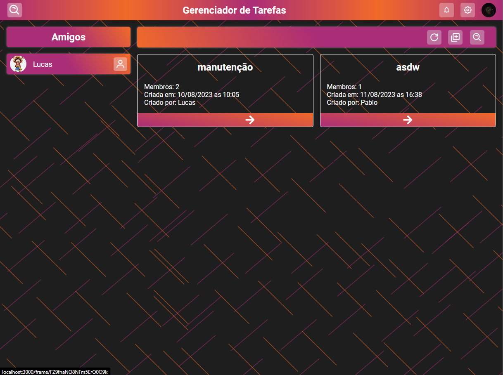
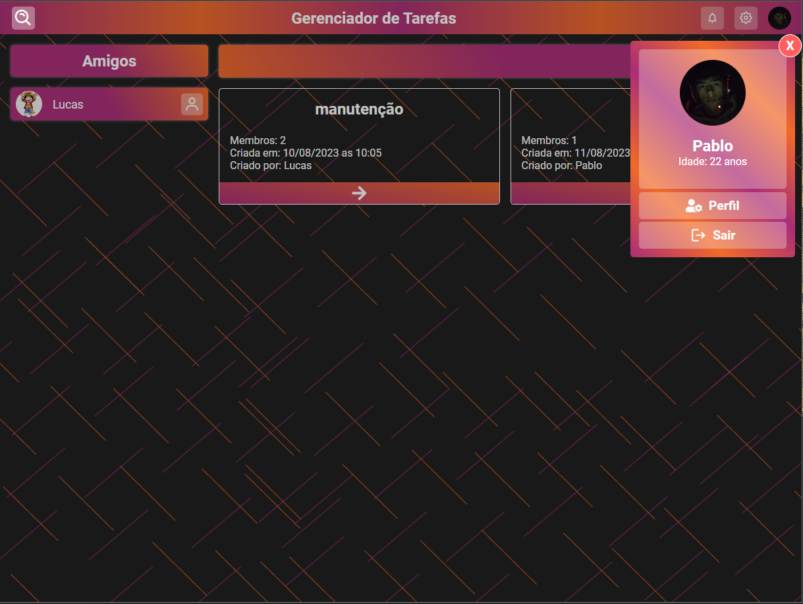
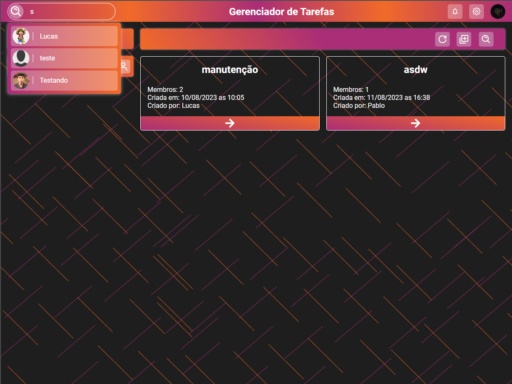

### Frame
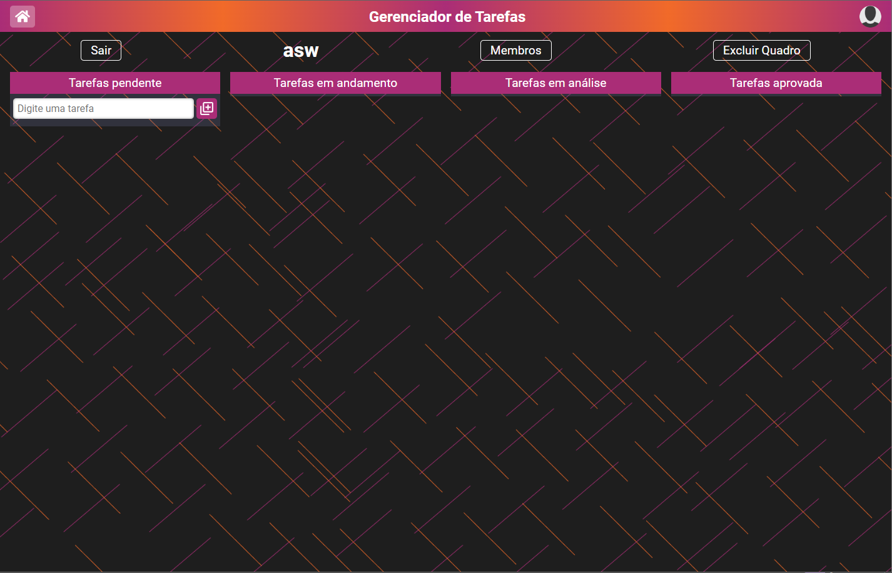
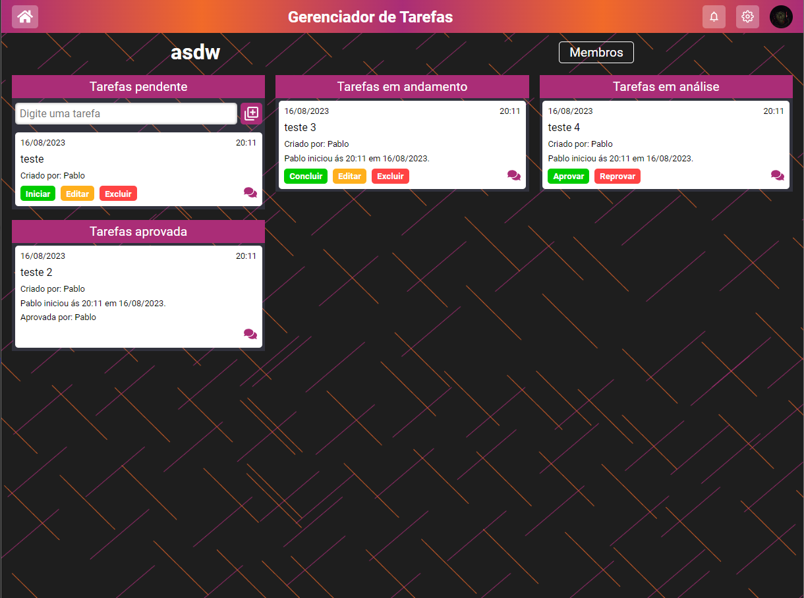
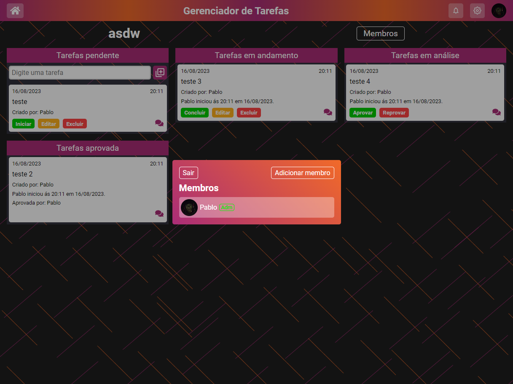
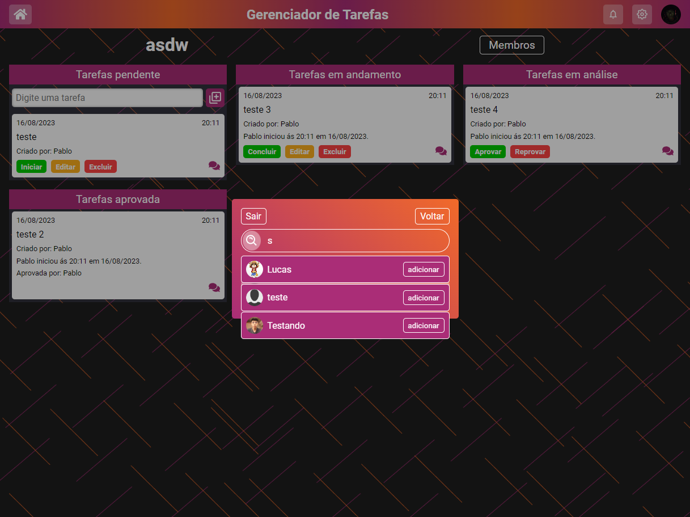
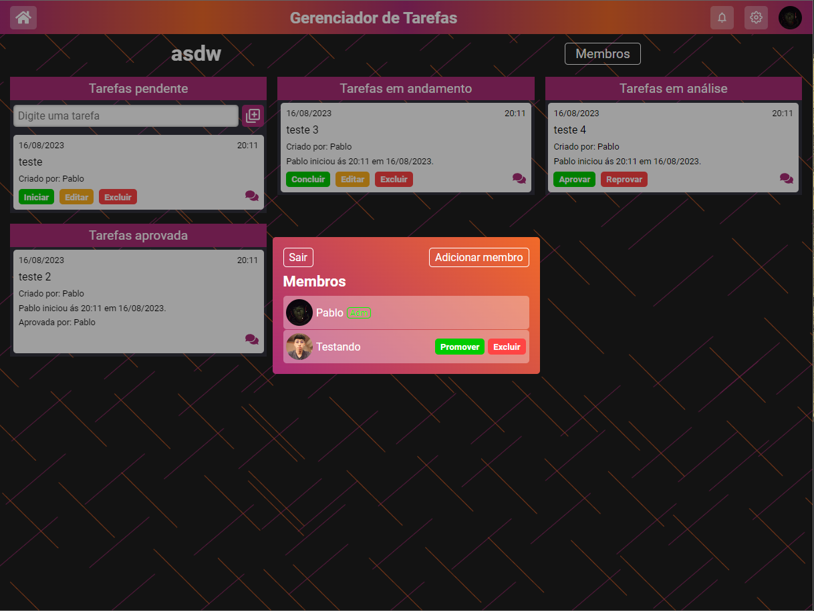
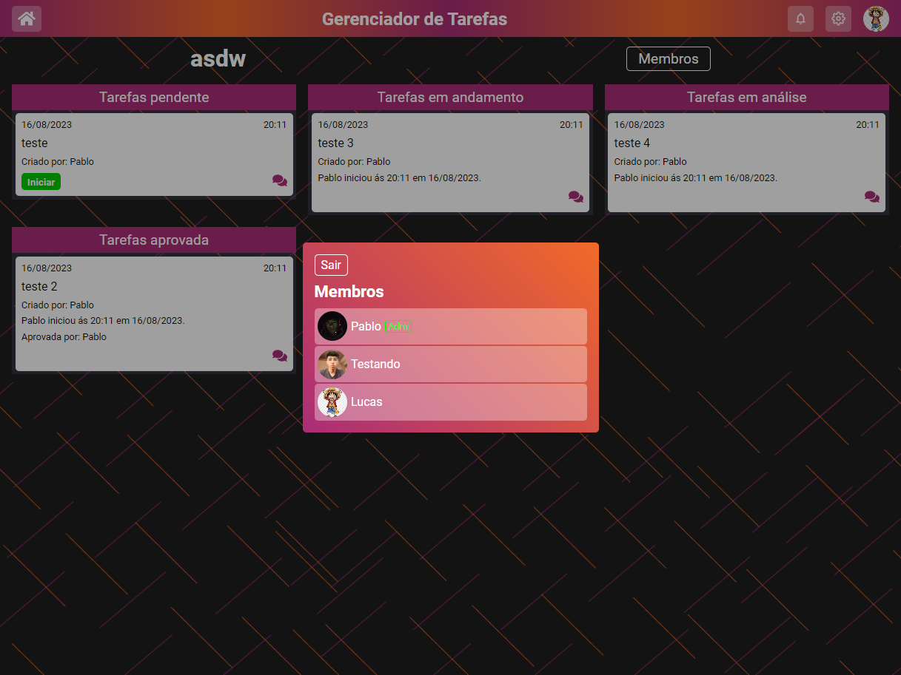

### Profile
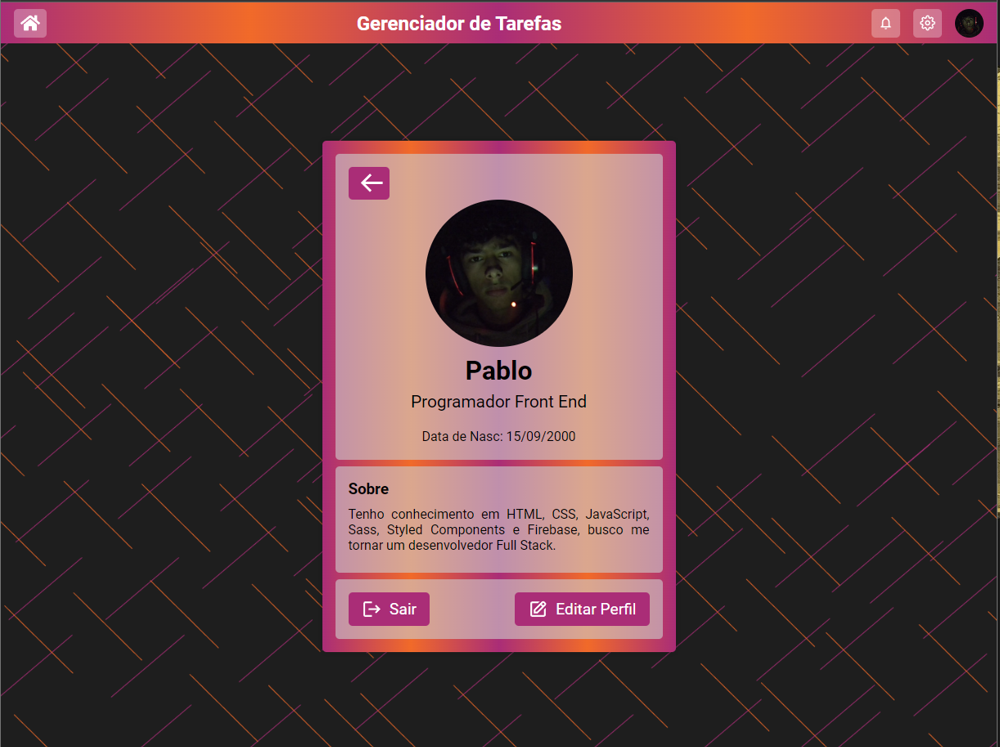
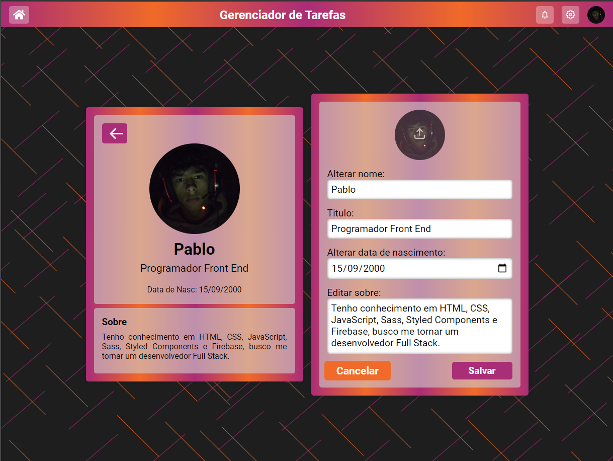

## Sobre

  Projeto está sendo desenvolvido utilizando React Js, Firebase, Sass, Toastify, React Hook form, React Router Dom, entre outras ferramentas...
  Até o momento estou disponibilizando o projeto em produção com funções de login, register, gerenciar amigos, quadros, membros. com validações que determinei que seriam necessárias.
  A ideia de colocar em produção mesmo que não esteja pronto foi para ter opniões e ideias diferentes, erros, bugs, para que possa ser corrigido, e tive alguns retornos de alguns bugs, e já incluí na lista de correções e melhorias.
  O planejamento e deixar bem completinho e evoluir meus conhecimentos.
  Algumas funcionalidades a serem acrescentadas são:  
  ### Funções 
  Notificações - Quando o usuário estiver participando de um quadro e ocorrer algum gerenciamento dentro do quadro irá receber essa notificação dentro do sistema.
  Configurações - Configurações de temas
  Comentarios - Comentar nas atividades 
  Prazo de conslusão - Adicionar um prazo de válidade as tarefas
  Determinar membro a executar tal atividade - Adms poderão atribuir tarefas a determinados membros

  Sistema de chat - Essa funcionalidade ainda não é certeza que será implementada mas e algo desáfiador.

Link: [Acesse aqui.](https://kanban-ribeirojr.netlify.app/).

